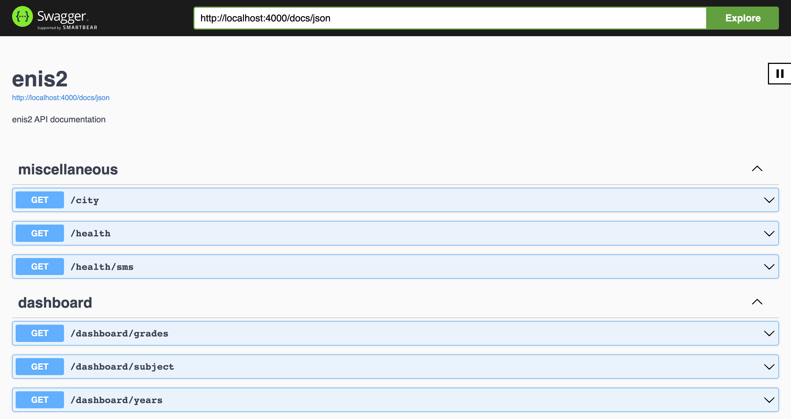

# enis2

[](https://stats.uptimerobot.com/kXD0runRnw/788722189)

One of many _enis_ implementations.

> _enis_ is a common name references unofficial client for an electronic school journal used in NIS schools.

approximate history

| app   | repo                                          | available at                                                                                                                                 | period              |
| :---- | :-------------------------------------------- | :------------------------------------------------------------------------------------------------------------------------------------------- | :------------------ |
| enis  | [src](https://github.com/superhooman/enis)    | -                                                                                                                                            | Dec 2017 - Apr 2019 |
| eNIS  | [src](https://github.com/kekland/enis-app.v3) | [Google Play](https://play.google.com/store/apps/details?id=com.kekland.enis)                                                                | Oct 2018 - Apr 2020 |
| enis2 | [src](https://github.com/anyrange/enis2)      | [web / PWA](https://enis2.space/)                                                                                                            | May 2021 - Present  |
| NISx  | -                                             | [Google Play](https://play.google.com/store/apps/details?id=com.release.nisx) / [App Store](https://apps.apple.com/us/app/nisx/id1621943978) | Apr 2022 - Apr 2023 |

## Known Issues

As it is described [here](https://github.com/superhooman/enis-proxy), NIS doesn't have a public API, so we had to do a custom server that works as an interlayer to bypass the CORS policy since the approach with a proxy server doesn't seem to work anymore. That's why it leads to additional delays and privacy concerns.

## Getting Started

This project requires [Node.js](https://nodejs.org/en/download/current/) 16+ and [pnpm](https://pnpm.io/)

### Copy env template file

```bash
cp apps/api/.env.development apps/api/.env
```

### Install

```bash
pnpm install
```

### Start

```bash
npm run dev
```

## API documentation

Starting the server will let you investigate the API via Swagger by getting detailed information about endpoints and their request/response schemas at [http://localhost:4000/docs](http://localhost:4000/docs)



## Contributing

- Fork the repo and create your branch from main
- Submit the pull request

## License

[MIT](/LICENSE)
